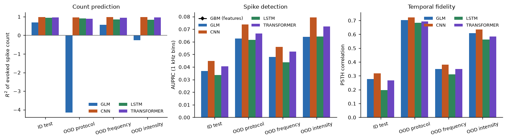
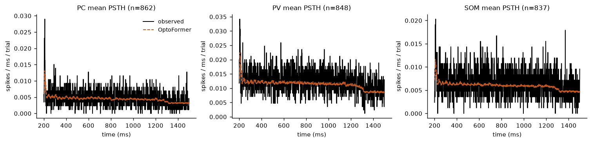
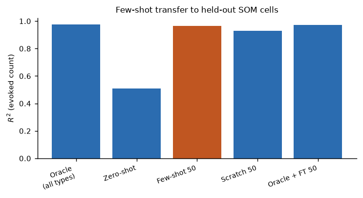
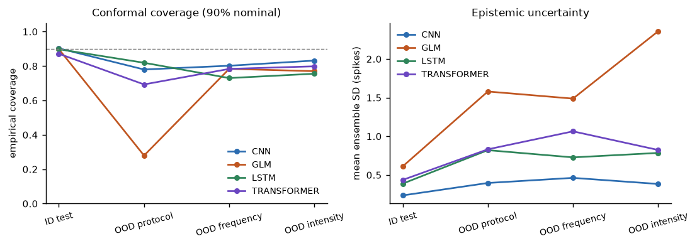
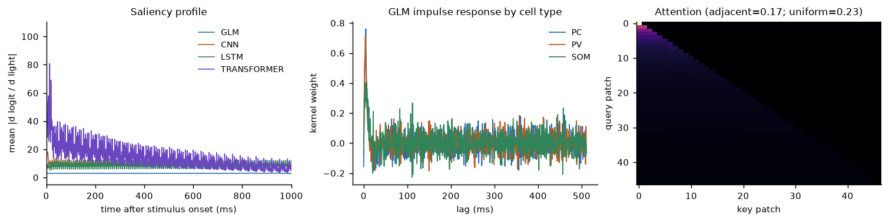
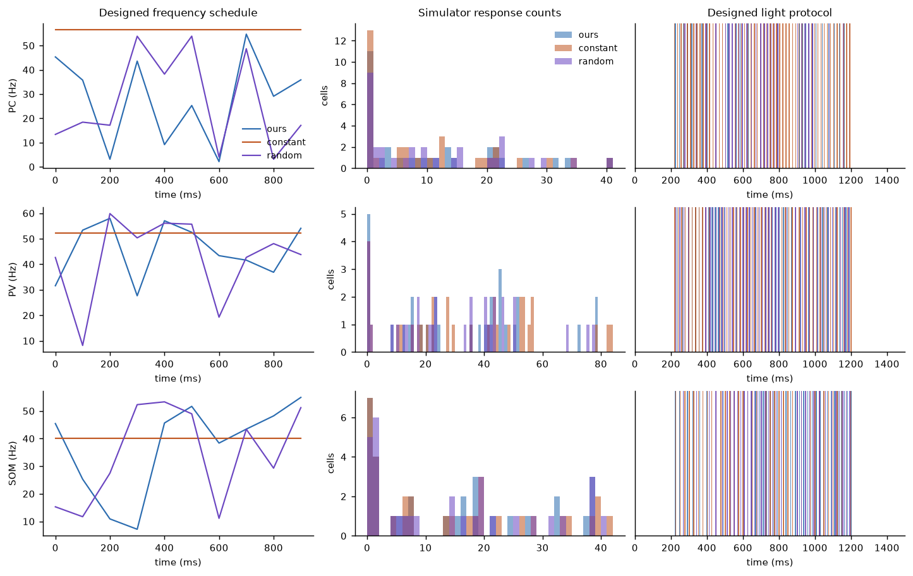

# 🔬 OptoNet — Deep Learning Predicts and Designs Neuron-Type-Specific Responses to Optogenetic Stimulation

[](https://github.com/basitali08/optonet/actions/workflows/ci.yml)
[](tests/)
[](https://www.python.org/)
[](https://pytorch.org/)
[](LICENSE)
[](paper/main.pdf)

**Author:** Basit Ali · Abdul Wali Khan University, Mardan, Pakistan
**Manuscript:** [`paper/main.pdf`](paper/main.pdf) · **Code:** MIT · **Tests:** 47 passing

**What this is.** A complete, reproducible machine-learning research project on
**optogenetics**: learn the mapping from a light-stimulation protocol to the
neuron's spike train, test whether it generalises to *unseen stimulation
regimes*, and then use the learned model **in the loop to design new
stimulation protocols** that are validated against a biophysical ground truth.

Everything — data generation, models, experiments, statistics, figures and the
manuscript — is reproduced by a handful of scripts on a **CPU-only laptop in
a few hours of compute**.

---

## 📑 Table of contents

<details open>
<summary><b>Click to expand / collapse</b></summary>

- [TL;DR — headline results](#tldr--the-headline-results)
- [Results at a glance](#results-at-a-glance)
- [Quick start](#quick-start)
- [The simulator (why the data is trustworthy)](#the-simulator-why-the-data-is-trustworthy)
- [Models](#models)
- [Experiments and findings](#experiments-and-findings)
- [Repository layout](#repository-layout)
- [Reproducibility](#reproducibility)
- [Tests and CI](#tests-and-ci)
- [Interactive demo](#interactive-demo)
- [Manuscript and submission](#manuscript-and-submission)
- [FAQ](#faq)
- [Citation](#citation)

</details>

---

## TL;DR — the headline results

| Question | Answer |
|---|---|
| Can ML predict spike trains from light traces? | Yes. OptoFormer reaches **R² = 0.96** on evoked spike counts (ID test) |
| Does it beat the classical encoding model (GLM)? | **Yes** — GLM = 0.69 R², deep models = 0.94–0.98 |
| Do gradient-boosted trees also work? | Yes in-distribution (**R² ≈ 0.79**) but they **collapse out-of-distribution** (**R² = −0.46** on unseen protocol families) |
| Do sequence models handle unseen protocols? | **Yes** — they degrade gracefully (0.90–0.96) while trees fail catastrophically |
| Can a new cell type be learned from a handful of cells? | Yes — **50 cells of a held-out type reach R² = 0.97 vs 0.97 for the oracle** (from-scratch: 0.93; with 10 cells: −0.21) |
| Can the model *design* stimulation? | Partially — surrogate-guided designs beat a constant-frequency search, and the **residual surrogate bias is measured** against the simulator (9.0 vs 0.65 spikes of error for a simulator scan) |

<details>
<summary><b>Exact numbers live in the tables — every figure below is clickable</b></summary>

All numbers above are generated by the pipeline into
[`results/tables/`](results/tables/) and inlined into the manuscript by
[`scripts/11_paper_numbers.py`](scripts/11_paper_numbers.py); nothing in the
paper is typed by hand.

</details>

---

## Results at a glance

Click any thumbnail to open the full-resolution figure (PNG for viewing, PDF
versions for the manuscript):

<table>
<tr>
<th align="center">Main results</th>
<th align="center">Out-of-distribution</th>
<th align="center">Few-shot transfer</th>
</tr>
<tr>
<td align="center"><a href="results/figures/fig4_main_results.png"></a><br>Fig 4 · ID + OOD by model</td>
<td align="center"><a href="results/figures/fig5_psth_examples.png"></a><br>Fig 5 · PSTH examples</td>
<td align="center"><a href="results/figures/fig8_transfer.png"></a><br>Fig 8 · 10–200 cells</td>
</tr>
<tr>
<th align="center">Uncertainty</th>
<th align="center">Interpretability</th>
<th align="center">Protocol design</th>
</tr>
<tr>
<td align="center"><a href="results/figures/fig6_uncertainty.png"></a><br>Fig 6 · coverage under shift</td>
<td align="center"><a href="results/figures/fig7_interpretability.png"></a><br>Fig 7 · saliency + attention</td>
<td align="center"><a href="results/figures/fig9_protocol_optimization.png"></a><br>Fig 9 · model-in-the-loop</td>
</tr>
</table>

Also: [Fig 1 · protocol examples](results/figures/fig1_protocol_examples.png) ·
[Fig 2 · simulator validation](results/figures/fig2_simulator_validation.png) ·
[Fig 3 · dataset overview](results/figures/fig3_dataset_overview.png)

---

## Quick start

```bash
pip install -r requirements.txt

# 1. generate the benchmark (61k trials, ~90 s on a laptop CPU)
python scripts/01_generate_data.py

# 2. classical baselines
python scripts/02_tabular_baselines.py

# 3. train the sequence models (GLM, CNN, LSTM, OptoFormer × 3 seeds)
python scripts/03_train_sequence.py            # resumable — skips finished runs

# 4. evaluate every model on every split
python scripts/04_evaluate.py

# 5-8. uncertainty, transfer, interpretability, closed-loop design
python scripts/05_uncertainty.py
python scripts/06_transfer.py
python scripts/07_interpretability.py
python scripts/08_protocol_optimization.py

# 9-11. figures, statistics and paper numbers
python scripts/09_figures.py
python scripts/10_statistics.py
python scripts/11_paper_numbers.py
```

Total: **≈ 4–6 h** on 6 CPU cores (no GPU required; script 03 is resumable).

Run the tests:

```bash
python -m pytest tests -q          # 47 passed
```

---

## The simulator (why the data is trustworthy)

Each neuron is an **adaptive exponential integrate-and-fire (AdEx)** model
(Brette & Gerstner, 2005) driven by a **two-state ChR2 photocurrent** with

* light-dependent activation, `m∞ = I²/(I² + K²)`,
* slow desensitisation (τ ≈ 0.7 s on, 2.5 s off) that produces realistic
  light-induced depression,
* voltage-dependent channel deactivation that terminates the photocurrent
  during spikes,

plus Ornstein–Uhlenbeck background fluctuations. Three cell types
(**PC** pyramidal, **PV** fast-spiking, **SOM** adapting) differ in membrane
time constant, adaptation and opsin expression (`g_opto` = 12 / 7 / 5.5 nS),
and every parameter is drawn from a log-normal population distribution, so the
model must handle real cell-to-cell variability.

The simulator reproduces the qualitative phenomenology measured in the
literature: a threshold-like intensity–response curve, high-fidelity pulse
following at low frequencies, following failure at high frequencies, and
cell-type-specific differences (PV cells tolerate 80 Hz trains where PC cells
depress). See [`fig2_simulator_validation.png`](results/figures/fig2_simulator_validation.png).

<details>
<summary><b>Benchmark composition (61,000 trials)</b></summary>

| Split | Trials | Purpose |
|---|---|---|
| train | 36,000 | in-distribution training |
| val | 7,000 | early stopping / model selection |
| test_id | 7,000 | in-distribution test |
| ood_proto | 5,000 | **unseen protocol families** |
| ood_freq | 3,000 | **unseen frequencies** (50–120 Hz) |
| ood_int | 3,000 | **unseen intensities** |
| train_pool + transfer | 4,000 + 6,000 | few-shot cross-cell-type experiments |

900 virtual neurons × 3 cell types, nine stimulation families, ground-truth
spike times at 0.1 ms resolution, rasters evaluated at 1 kHz
(base spike rate 0.008).

</details>

---

## Models

| Model | Idea | Params |
|---|---|---|
| `glm` | cell-type specific causal **linear–nonlinear encoding model** (the standard tool in systems neuroscience) | ~1.6k |
| `cnn` | causal **dilated CNN** on 8 ms frames, FiLM-style cell conditioning | ~44k |
| `lstm` | strided causal CNN front-end + **LSTM** | ~57k |
| `transformer` | **OptoFormer**: patch embedding + FiLM conditioning + causal transformer encoder | ~149k |
| `hgb` | **gradient-boosted trees** on handcrafted protocol features | — |

<details>
<summary><b>Training protocol (identical across sequence models)</b></summary>

* Same loss (binary cross-entropy at 1 kHz), same splits, same optimiser and
  the same seeds (11, 22, 33) for every model.
* **Causal up to the analysis frame** (8 ms for CNN/LSTM, 32 ms for the
  transformer): a unit test (`tests/test_models.py::test_no_future_leakage_beyond_group`)
  verifies that perturbing the light trace after a time step cannot change any
  earlier prediction.
* 10 epochs (15 for the GLM), early stopping on validation loss, batch size
  256 (64 for the CNN), single config file:
  [`configs/default.yaml`](configs/default.yaml).

</details>

---

## Experiments and findings

| # | Experiment | Script | Finding | Output |
|---|---|---|---|---|
| 1 | ID + OOD evaluation | [`04_evaluate.py`](scripts/04_evaluate.py) | Deep models 0.94–0.98 ID; trees **collapse to −0.46** on unseen protocol families; GLM falls to −4.16 | [`sequence_metrics.csv`](results/tables/sequence_metrics.csv) |
| 2 | Uncertainty quantification | [`05_uncertainty.py`](scripts/05_uncertainty.py) | Deep ensembles + split-conformal: ID coverage ≈ 0.87–0.90, degrades under shift; ensemble std rises exactly where it should | [`uncertainty.csv`](results/tables/uncertainty.csv) |
| 3 | Few-shot cell-type transfer | [`06_transfer.py`](scripts/06_transfer.py) | Held-out SOM type: **50 cells → R² 0.97** (oracle 0.97); from-scratch with 10 cells → **−0.21** | [`transfer.csv`](results/tables/transfer.csv) |
| 4 | Interpretability | [`07_interpretability.py`](scripts/07_interpretability.py) | Saliency onset-concentrated (shuffle control destroys it: AUPRC 0.008 ≈ base rate); GLM kernel peaks at 5/4/7 ms — the fast photocurrent onset; attention is *anti*-local (0.287 vs 0.424 uniform) | [`interpretability.csv`](results/tables/interpretability.csv) |
| 5 | Model-in-the-loop design | [`08_protocol_optimization.py`](scripts/08_protocol_optimization.py) | Surrogate search beats constant-frequency (9.04 vs 10.16 spikes MAE); a simulator scan reaches 0.65 → **the residual bias is quantified, not hidden** | [`protocol_opt.csv`](results/tables/protocol_opt.csv) |
| 6 | Statistics | [`10_statistics.py`](scripts/10_statistics.py) | Bootstrap 95% CIs, seed-to-seed SDs, Wilcoxon + Holm-corrected pairwise tests | [`statistics.csv`](results/tables/statistics.csv), [`significance.csv`](results/tables/significance.csv) |
| 7 | Calibration | [`05_uncertainty.py`](scripts/05_uncertainty.py) | Reliability curves for the deep ensembles | [`calibration.csv`](results/tables/calibration.csv) |

---

## Repository layout

```
optonet/
├── src/optonet/
│   ├── simulate.py        AdEx neuron + two-state ChR2 photocurrent simulator
│   ├── protocols.py       9 stimulation families + train/OOD split definitions
│   ├── data.py            dataset construction, storage, torch data store
│   ├── features.py        handcrafted features for classical baselines
│   ├── models/            SpikeGLM, SpikeCNN, SpikeLSTM, OptoFormer, GBM
│   ├── train.py           training loops (causal, early stopping)
│   ├── metrics.py         AUPRC / R² / PSTH correlation / conformal helpers
│   └── config.py          YAML config loading
├── scripts/               01 → 11, the full pipeline
├── tests/                 47 unit tests (biophysics, causality, data, metrics)
├── configs/default.yaml   every hyper-parameter of the paper
├── results/               tables, figures, checkpoints, logs
├── paper/main.tex         manuscript (SSRN-ready LaTeX source + PDF)
├── app.py                 Streamlit demo: draw a protocol, see the predicted PSTH
├── docs/                  METHODS.md · REAL_DATA.md · SSRN_SUBMISSION.md
└── .github/workflows/ci.yml
```

---

## Reproducibility

* One YAML config holds every hyper-parameter (`configs/default.yaml`).
* All seeds are fixed; the dataset generator is fully deterministic given the
  seed (`meta.json` records generation time and split sizes).
* Results are written as CSV so every number in the paper can be traced back to
  a file in `results/tables/`.
* The paper's macros and table bodies are **generated** by
  `scripts/11_paper_numbers.py` directly into `paper/main.tex` between
  `% BEGIN AUTO …` markers rather than typed.
* Training is **resumable**: `03_train_sequence.py` skips any
  (model, seed) pair already recorded in `results/tables/train_log.csv`.

---

## Tests and CI

```bash
python -m pytest tests -q     # 47 passed, ~10 s
```

[GitHub Actions](.github/workflows/ci.yml) runs on every push: installs
dependencies, regenerates the dataset, runs the full test suite, and executes a
smoke pipeline (tabular baselines + two figures) on Python 3.10–3.12.

---

## Interactive demo

```bash
streamlit run app.py
```

Pick a cell type, set the protocol parameters (pulses, widths, intensity), and
the trained OptoFormer predicts the spike train — then compare against the
ground-truth simulator in the same window. If no checkpoint is present the app
still runs the simulator and tells you how to train one.

---

## Manuscript and submission

* **Read the paper:** [`paper/main.pdf`](paper/main.pdf) (13 pages, 9 figures,
  2 tables) — source in [`paper/main.tex`](paper/main.tex), bibliography in
  [`paper/refs.bib`](paper/refs.bib).
* **SSRN submission walkthrough:** [`docs/SSRN_SUBMISSION.md`](docs/SSRN_SUBMISSION.md).
* **Would it work on real data?** Honest answer in
  [`docs/REAL_DATA.md`](docs/REAL_DATA.md).
* **Methods in full:** [`docs/METHODS.md`](docs/METHODS.md).

---

## FAQ

<details>
<summary><b>Is this only a simulation study?</b></summary>

Yes — and the paper says so explicitly (Limitations §6). The simulator is
biophysically grounded (AdEx + two-state ChR2) and the benchmark is designed so
that the *methods* transfer to real recordings; `docs/REAL_DATA.md` explains
exactly how, and which public datasets would fit.

</details>

<details>
<summary><b>Why do gradient-boosted trees fail out-of-distribution?</b></summary>

They see only handcrafted summary features of the protocol and cannot represent
the sequential structure, so they interpolate inside their training support and
extrapolate wildly outside it (R² = −0.46 on unseen protocol families). The
sequence models read the light trace itself and degrade gracefully (0.90–0.96).
This contrast is the paper's headline.

</details>

<details>
<summary><b>Is the comparison fair? Are the models causal?</b></summary>

Identical loss, splits, optimiser and metrics; parameter counts reported.
Causality is *unit-tested*: perturbing the light trace after a time step cannot
change any earlier prediction
(`tests/test_models.py::test_no_future_leakage_beyond_group`).

</details>

<details>
<summary><b>Do I need a GPU? How long does it take?</b></summary>

No — everything runs on a 6-core CPU laptop in ≈ 4–6 hours. Script 03
(training) is resumable, so an interrupted run continues where it stopped.

</details>

<details>
<summary><b>Where are the trained checkpoints?</b></summary>

`.pt` checkpoints and the generated dataset are *not* committed (they are
regenerable); the repo keeps every CSV, figure, training history and the
training log so results are auditable. Run `01` then `03` to rebuild them —
or just read the committed result tables.

</details>

---

## Citation

```bibtex
@misc{ali2026optonet,
  author       = {Basit Ali},
  title        = {OptoNet: Deep Learning Predicts and Designs
                  Neuron-Type-Specific Responses to Optogenetic Stimulation},
  year         = {2026},
  howpublished = {GitHub repository},
  url          = {https://github.com/basitali08/optonet},
  note         = {Manuscript: paper/main.pdf}
}
```

If you use this code or the benchmark, please also cite the underlying models:

* Brette, S. & Gerstner, W. (2005). *Adaptive exponential integrate-and-fire
  models as realistic descriptions of neuronal activity.* J. Comput. Neurosci. 25.
* Nagel, S. et al. (2003). *Light activation of channelrhodopsin.*
  PNAS 100.
* Foutz, T. J. et al. (2012). *Basis for a slow activity-dependent
  photocurrent in channelrhodopsin-2.* J. Gen. Physiol. 140.

---

## License

MIT — see [LICENSE](LICENSE).
